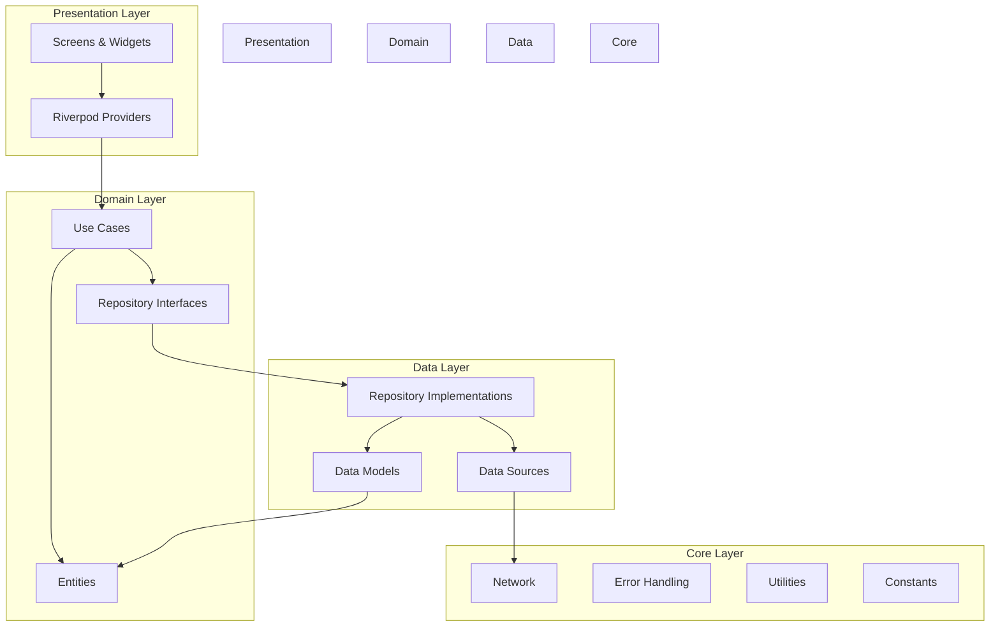
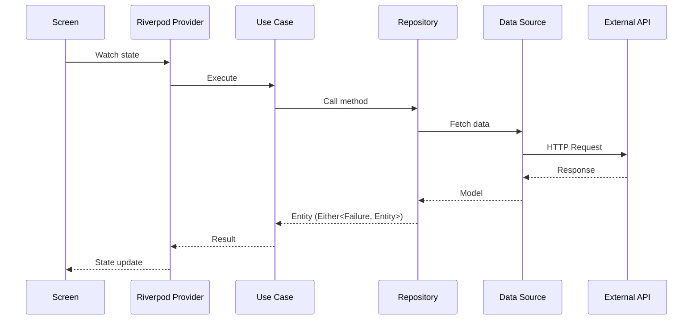

# Architecture Guide - Personality FYI App

## Overview

This project follows **Clean Architecture** principles to ensure separation of concerns, testability, and maintainability. The codebase is organized into distinct layers with clear boundaries and unidirectional data flow.

## Architecture Diagram



## Directory Structure

```
lib/
├── main.dart                    # Application entry point
├── app.dart                     # App configuration (MaterialApp, Router)
│
├── config/                      # App configuration
│   ├── app_router.dart          # GoRouter configuration
│   ├── app_theme.dart           # Theme definitions (light/dark)
│   └── env_config.dart          # Environment variables management
│
├── core/                        # Shared utilities and constants
│   ├── constants/
│   │   ├── api_constants.dart   # API endpoints and keys
│   │   └── app_constants.dart   # App-wide constants
│   ├── errors/
│   │   ├── exceptions.dart      # Custom exception classes
│   │   └── failures.dart        # Failure classes for Either
│   ├── network/
│   │   ├── dio_client.dart      # Dio HTTP client setup
│   │   └── network_info.dart    # Connectivity checker
│   └── utils/
│       └── translation_service.dart  # Translation utility
│
├── data/                        # Data layer
│   ├── datasources/
│   │   ├── personality_local_datasource.dart   # Hive local storage
│   │   └── personality_remote_datasource.dart  # API calls
│   ├── models/                  # Data models with JSON serialization
│   │   ├── mbti_type_model.dart
│   │   ├── mbti_type_detail_model.dart
│   │   ├── score_response_model.dart
│   │   ├── test_item_model.dart
│   │   └── test_result_model.dart
│   ├── repositories/            # Repository implementations
│   │   └── personality_repository_impl.dart
│   └── static/
│       └── personality_static_data.dart  # Static personality data
│
├── di/                          # Dependency injection
│   └── injection_container.dart # GetIt service locator setup
│
├── domain/                      # Domain layer (business logic)
│   ├── entities/                # Business objects
│   │   ├── mbti_type.dart
│   │   ├── mbti_type_detail.dart
│   │   ├── score_response.dart
│   │   ├── test_item.dart
│   │   └── test_result.dart
│   ├── repositories/            # Repository interfaces
│   │   └── personality_repository.dart
│   └── usecases/                # Business logic use cases
│       ├── compare_types.dart
│       ├── get_all_types.dart
│       ├── get_history.dart
│       ├── get_personality_details.dart
│       ├── get_test_items.dart
│       ├── get_type_details.dart
│       ├── save_result.dart
│       └── score_test.dart
│
├── presentation/                # UI layer
│   ├── screens/                 # Screen widgets
│   │   ├── splash_screen.dart
│   │   ├── onboarding_screen.dart
│   │   ├── home_screen.dart
│   │   ├── test_screen.dart
│   │   ├── result_screen.dart
│   │   ├── personality_detail_screen.dart
│   │   ├── compatibility_screen.dart
│   │   ├── history_screen.dart
│   │   ├── settings_screen.dart
│   │   └── about_screen.dart
│   ├── widgets/                 # Reusable UI components
│   │   ├── question_card.dart
│   │   └── personality_type_badge.dart
│   └── providers/               # Riverpod state management
│       ├── test_provider.dart
│       ├── history_provider.dart
│       ├── settings_provider.dart
│       └── translation_provider.dart
│
└── l10n/                        # Localization files
```

## Layer Details

### 1. Domain Layer (Innermost)

The domain layer contains the core business logic and is independent of any framework or implementation details.

**Entities** - Pure Dart classes representing business objects:
```dart
// Example: lib/domain/entities/mbti_type.dart
class MbtiType {
  final String code;
  final String name;
  final String description;
  // ... pure business properties
}
```

**Use Cases** - Single-responsibility business operations:
```dart
// Example: lib/domain/usecases/get_all_types.dart
class GetAllTypes {
  final PersonalityRepository repository;
  
  GetAllTypes(this.repository);
  
  Future<Either<Failure, List<MbtiType>>> call() async {
    return await repository.getAllTypes();
  }
}
```

**Repository Interfaces** - Abstract contracts for data access:
```dart
// Example: lib/domain/repositories/personality_repository.dart
abstract class PersonalityRepository {
  Future<Either<Failure, List<MbtiType>>> getAllTypes();
  Future<Either<Failure, MbtiTypeDetail>> getTypeDetails(String typeCode);
  Future<Either<Failure, ScoreResponse>> scoreTest(List<TestItem> items);
  // ...
}
```

### 2. Data Layer

The data layer implements repository interfaces and manages data from various sources.

**Models** - Data classes with JSON serialization:
```dart
// Example: lib/data/models/mbti_type_model.dart
@JsonSerializable()
class MbtiTypeModel extends MbtiType {
  factory MbtiTypeModel.fromJson(Map<String, dynamic> json) => 
      _$MbtiTypeModelFromJson(json);
  
  Map<String, dynamic> toJson() => _$MbtiTypeModelToJson(this);
}
```

**Data Sources** - Abstract data access:
- `RemoteDataSource` - API calls via Dio
- `LocalDataSource` - Hive local storage

**Repository Implementations** - Orchestrate data sources:
```dart
class PersonalityRepositoryImpl implements PersonalityRepository {
  final PersonalityRemoteDataSource remoteDataSource;
  final PersonalityLocalDataSource localDataSource;
  final NetworkInfo networkInfo;

  @override
  Future<Either<Failure, List<MbtiType>>> getAllTypes() async {
    if (await networkInfo.isConnected) {
      try {
        final types = await remoteDataSource.getAllTypes();
        await localDataSource.cacheTypes(types);
        return Right(types);
      } on ServerException {
        return Left(ServerFailure());
      }
    } else {
      try {
        final cachedTypes = await localDataSource.getCachedTypes();
        return Right(cachedTypes);
      } on CacheException {
        return Left(CacheFailure());
      }
    }
  }
}
```

### 3. Presentation Layer

**Screens** - Full-page widgets using Flutter:
```dart
class HomeScreen extends ConsumerWidget {
  @override
  Widget build(BuildContext context, WidgetRef ref) {
    final types = ref.watch(allTypesProvider);
    // Build UI based on state
  }
}
```

**Providers** - Riverpod state management:
```dart
@riverpod
Future<List<MbtiType>> getAllTypes(GetAllTypesRef ref) async {
  final useCase = ref.read(getAllTypesUseCaseProvider);
  final result = await useCase();
  return result.fold(
    (failure) => throw failure,
    (types) => types,
  );
}
```

### 4. Core Layer

Shared utilities used across all layers:
- **Network**: Dio client configuration, connectivity checking
- **Errors**: Custom exceptions and failure types
- **Constants**: API endpoints, app-wide values
- **Utils**: Translation service, helpers

## Data Flow



## State Management

The app uses **Riverpod** for state management with code generation:

### Provider Types Used

1. **FutureProvider** - For async data fetching:
```dart
@riverpod
Future<List<MbtiType>> getAllTypes(GetAllTypesRef ref) async { ... }
```

2. **NotifierProvider** - For complex state logic:
```dart
@riverpod
class TestNotifier extends _$TestNotifier {
  @override
  TestState build() => TestState.initial();
  
  Future<void> submitTest() async { ... }
}
```

3. **Provider** - For synchronous dependencies:
```dart
@riverpod
PersonalityRepository personalityRepository(PersonalityRepositoryRef ref) {
  return ref.read(personalityRepositoryImplProvider);
}
```

## Dependency Injection

Uses **GetIt** as a service locator for dependency injection:

```dart
// lib/di/injection_container.dart
final sl = GetIt.instance;

Future<void> init() async {
  // External
  sl.registerLazySingleton(() => Dio());
  sl.registerLazySingleton(() => Hive);
  
  // Core
  sl.registerLazySingleton<NetworkInfo>(() => NetworkInfoImpl(sl()));
  
  // Data Sources
  sl.registerLazySingleton<PersonalityRemoteDataSource>(
    () => PersonalityRemoteDataSourceImpl(dio: sl()),
  );
  sl.registerLazySingleton<PersonalityLocalDataSource>(
    () => PersonalityLocalDataSourceImpl(hive: sl()),
  );
  
  // Repository
  sl.registerLazySingleton<PersonalityRepository>(
    () => PersonalityRepositoryImpl(
      remoteDataSource: sl(),
      localDataSource: sl(),
      networkInfo: sl(),
    ),
  );
  
  // Use Cases
  sl.registerLazySingleton(() => GetAllTypes(sl()));
  sl.registerLazySingleton(() => GetTypeDetails(sl()));
  // ...
}
```

## Error Handling

Uses **dartz** `Either` type for functional error handling:

```dart
// Failure hierarchy
abstract class Failure {}

class ServerFailure extends Failure {}
class CacheFailure extends Failure {}
class NetworkFailure extends Failure {}

// Usage in repositories
Future<Either<Failure, MbtiType>> getType(String code) async {
  try {
    final result = await remoteDataSource.getType(code);
    return Right(result);
  } on ServerException {
    return Left(ServerFailure());
  }
}
```

## Key Design Patterns

| Pattern | Implementation | Purpose |
|---------|---------------|---------|
| Clean Architecture | Layer separation | Maintainability |
| Repository Pattern | `PersonalityRepository` | Data abstraction |
| Use Case Pattern | Individual use case classes | Single responsibility |
| Provider Pattern | Riverpod providers | State management |
| Service Locator | GetIt | Dependency injection |
| Either Pattern | dartz `Either<L, R>` | Error handling |
| Factory Pattern | Model `fromJson()` | Object creation |

## Testing Strategy

```
test/
├── unit/
│   ├── domain/usecases/       # Use case tests
│   ├── data/repositories/     # Repository tests
│   └── data/datasources/      # Data source tests
├── widget/
│   ├── screens/               # Screen widget tests
│   └── widgets/               # Component widget tests
└── integration/
    └── api_integration_test.dart
```

### Test Dependencies
- `mocktail` - Mocking framework
- `flutter_test` - Flutter testing utilities

## Adding New Features

1. **Add Entity** in `domain/entities/`
2. **Add Model** in `data/models/` with JSON serialization
3. **Add Repository Method** in `domain/repositories/`
4. **Implement Repository Method** in `data/repositories/`
5. **Add Data Source Methods** if needed
6. **Create Use Case** in `domain/usecases/`
7. **Register Dependencies** in `di/injection_container.dart`
8. **Create Provider** in `presentation/providers/`
9. **Build Screen** in `presentation/screens/`
10. **Add Route** in `config/app_router.dart`

## Resources

- [Clean Architecture by Robert C. Martin](https://blog.cleancoder.com/uncle-bob/2012/08/13/the-clean-architecture.html)
- [Flutter Riverpod Documentation](https://riverpod.dev/)
- [Functional Programming with dartz](https://pub.dev/packages/dartz)
